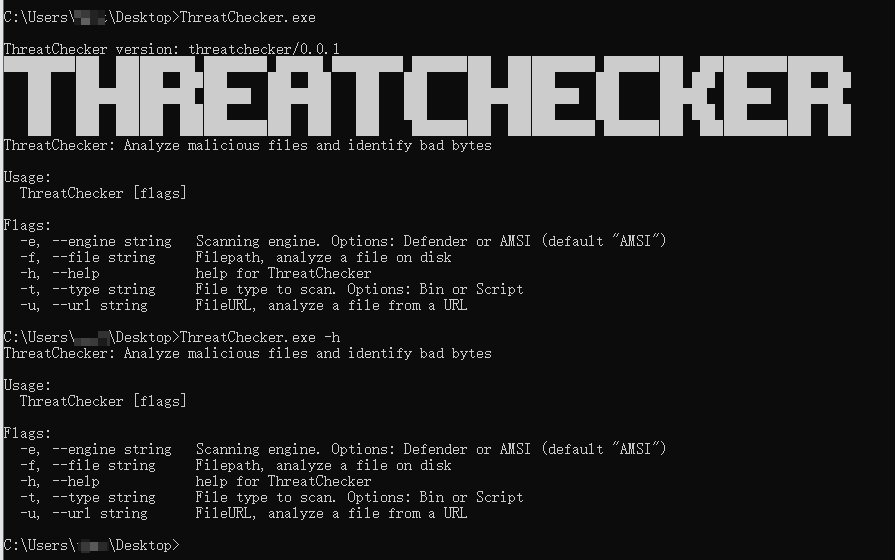
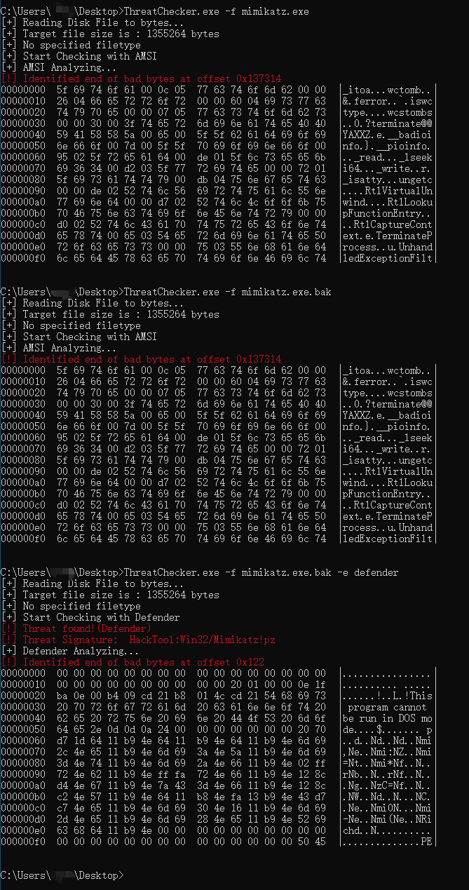
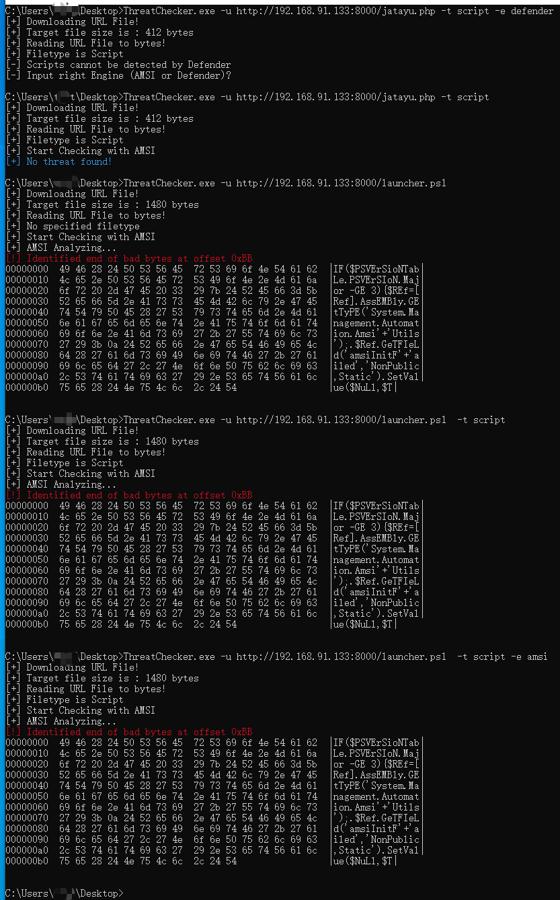

# ThreatChecker

ThreatChecker is a malware analysis tool written in Golang, can be used to detect whether a file is malicious by AMSI and Defender and display relevant detection results, including identifying the specific bad pieces of code, Currently, binary files and script files are supported. This version:

- Identifies the bytes that Microsoft Defender / AMSI Consumer flags on.
- Detect URL files, as well as files on disk.
- Automatically check file type
- Support binary files and some scripts 
- Displays key result information by color.


> [Anti-malware Scan Interface (AMSI) integration with Microsoft Defender Antivirus](https://learn.microsoft.com/en-us/defender-endpoint/amsi-on-mdav): AMSI provides a deeper level of inspection for malicious software that employs obfuscation and evasion techniques on Windows' built-in scripting hosts. By integrating AMSI, Microsoft Defender for Endpoint offers extra layers of protection against advanced threats.
> AMSI Supported Scripting Languages: PowerShell, Jscript, VBScript, Windows Script Host (wscript.exe and cscript.exe), NET Framework 4.8 or newer (scanning of all assemblies), Windows Management Instrumentation (WMI)


## Usage

helptext:

```bash
ThreatChecker version: threatchecker/0.0.1
████████ ██   ██ ██████  ███████  █████  ████████  ██████ ██   ██ ███████  ██████ ██   ██ ███████ ██████  
   ██    ██   ██ ██   ██ ██      ██   ██    ██    ██      ██   ██ ██      ██      ██  ██  ██      ██   ██ 
   ██    ███████ ██████  █████   ███████    ██    ██      ███████ █████   ██      █████   █████   ██████  
   ██    ██   ██ ██   ██ ██      ██   ██    ██    ██      ██   ██ ██      ██      ██  ██  ██      ██   ██ 
   ██    ██   ██ ██   ██ ███████ ██   ██    ██     ██████ ██   ██ ███████  ██████ ██   ██ ███████ ██   ██
ThreatChecker: ThreatChecker: Analyze malicious files and identify bad bytes

Usage:
  ThreatChecker [flags]

Flags:
  -e, --engine string   Scanning engine. Options: Defender or AMSI(Default: AMSI) (default "AMSI")
  -f, --file string     Filepath, analyze a file on disk
  -h, --help            help for ThreatChecker
  -t, --type string     File type to scan. Options: Bin or Script
  -u, --url string      FileURL, analyze a file from a URL
```

run it with `go run main.go`:

```bash
go run main.go -e defender -f .\\\mimikatz.exe.bak -t Bin 
go run main.go -e amsi -f .\\\mimikatz.exe.bak -t Bin 
go run main.go -u http://192.168.91.133:8000/launcher.ps1 -t script
go run main.go -f launcher.ps1 -t script
go run main.go -f launcher.ps1 
go run main.go -f .\\\mimikatz.exe.bak
```


example:





## Note


Note: This tool can only be used for security research and malware analysis teaching. It is strictly forbidden to use this tool for malicious activities and unethical behavior, otherwise the consequences will be borne by the users themselves, and have nothing to do with the developers.


## FAQ

Q1: `Error initializing AMSI: The system cannot find the file specified.`
A1: Please ensure real-time protection is enabled.


Q2:`Failed to scan buffer: The operation completed successfully.`  
A2: Please ensure Windows Security Center is enabled.


## Acknowledgements / References

The project is inspired by the following projects:
- https://github.com/Hubbl3/ThreatCheck
- https://github.com/rasta-mouse/ThreatCheck
- https://github.com/matterpreter/DefenderCheck
