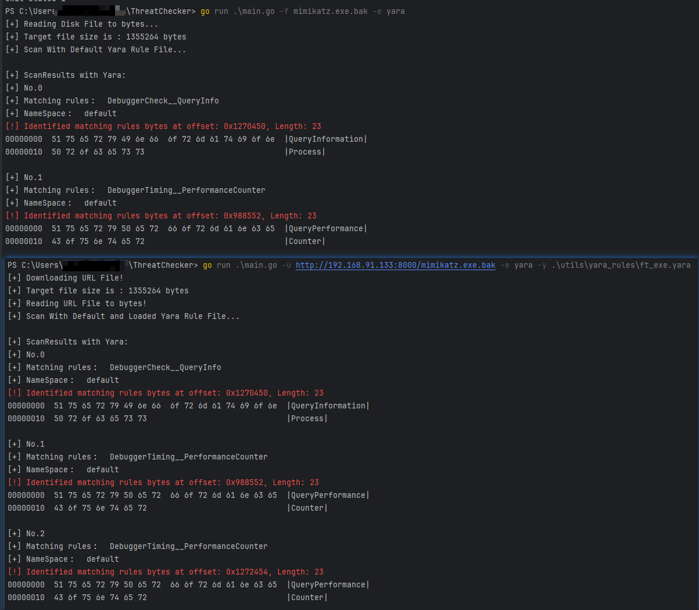

# ThreatChecker

ThreatChecker is a malware analysis tool written in Golang, can be used to detect whether a file is malicious by AMSI or Defender or Yara-X and display relevant detection results, including identifying the specific bad pieces of code, Currently, binary files and script files are supported. This version:

- Identified the bytes by [Yara-X](https://virustotal.github.io/yara-x/) (https://github.com/VirusTotal/yara-x).
  - Two yara rules are built in (you can change them in the source code to suit your needs)
  - You can specify the custom yara rule file through `yarafile`flag
- Identifies the bytes that Microsoft Defender / AMSI Consumer flags on.
- Detect URL files, as well as files on disk.
- Automatically check file type
- Support binary files and some scripts 
- Displays key result information by color.


> [Yara-X](https://virustotal.github.io/yara-x/): YARA-X is a re-incarnation of YARA, with a focus on user-friendliness, performance and safety

> [Anti-malware Scan Interface (AMSI) integration with Microsoft Defender Antivirus](https://learn.microsoft.com/en-us/defender-endpoint/amsi-on-mdav): AMSI provides a deeper level of inspection for malicious software that employs obfuscation and evasion techniques on Windows' built-in scripting hosts. By integrating AMSI, Microsoft Defender for Endpoint offers extra layers of protection against advanced threats.
> AMSI Supported Scripting Languages: PowerShell, Jscript, VBScript, Windows Script Host (wscript.exe and cscript.exe), NET Framework 4.8 or newer (scanning of all assemblies), Windows Management Instrumentation (WMI)


## INSTALLATION

If you do not want to install yara-x related environment, you can use version 0.0.1

### yara-x

1. Install `gcc` and [`pkg-config`](https://stackoverflow.com/questions/1710922/how-to-install-pkg-config-in-windows) on Windows
2. Install cargo with `curl --proto '=https' --tlsv1.2 -sSf https://sh.rustup.rs | sh` command
3. Install`cargo-c` with `cargo install cargo-c` command
4. Go to download https://github.com/VirusTotal/yara-x/archive/refs/heads/main.zip 
5. Go to the root directory of the YARA-X repository and type `cargo cinstall -p yara-x-capi --release`
6. After compiling successfully in Windows, you will get the target/x86_64-pc-windows-msvc/release directory
   - A header file yara_x.h 
   - A module definition file yara_x_capi.def 
   - A DLL file yara_x_capi.dll with its corresponding import library yara_x_capi.dll.lib 
   - A static library yara_x_capi.lib
7. Put the header and library files in the correct path so that `gcc` and `pkg-config` can recognize and run correctly. You can use `pkg-config --cflags --libs yara_x_capi`  to check whether the configuration is successfuly

> [Go API](https://virustotal.github.io/yara-x/docs/api/go/): The Go library uses the [C API](https://virustotal.github.io/yara-x/docs/api/c/c-/) under the hood, so the first thing you must do is building and installing the C library as explained in [Building the C library](https://virustotal.github.io/yara-x/docs/api/c/c-/#building-the-c-library).


## Usage


Run it with `go run main.go`:

```bash
go run main.go -e defender -f .\\\mimikatz.exe.bak -t Bin 
go run main.go -e amsi -f .\\\mimikatz.exe.bak -t Bin 
go run .\main.go -u http://192.168.91.133:8000/launcher.ps1 -t script
go run .\main.go -f launcher.ps1 -t script
```

helptext:

```bash
ThreatChecker version: threatchecker/0.0.2
████████ ██   ██ ██████  ███████  █████  ████████  ██████ ██   ██ ███████  ██████ ██   ██ ███████ ██████  
   ██    ██   ██ ██   ██ ██      ██   ██    ██    ██      ██   ██ ██      ██      ██  ██  ██      ██   ██ 
   ██    ███████ ██████  █████   ███████    ██    ██      ███████ █████   ██      █████   █████   ██████  
   ██    ██   ██ ██   ██ ██      ██   ██    ██    ██      ██   ██ ██      ██      ██  ██  ██      ██   ██ 
   ██    ██   ██ ██   ██ ███████ ██   ██    ██     ██████ ██   ██ ███████  ██████ ██   ██ ███████ ██   ██
ThreatChecker: Analyze malicious files and identify bad bytes

Usage:
  ThreatChecker [flags]

Flags:
  -e, --engine string     Scanning engine. Options: Defender or AMSI or Yara (default "AMSI")
  -f, --file string       Filepath, analyze a file on disk
  -h, --help              help for ThreatChecker
  -t, --type string       File type to scan. Options: Bin or Script
  -u, --url string        FileURL, analyze a file from a URL
  -y, --yarafile string   YaraFile, Specify the Yara file for analysis
```

example:





## HISTORY


Version 0.0.1:
```bash
This version:

   - Identifies the bytes that Microsoft Defender / AMSI Consumer flags on.
   - Detect URL files, as well as files on disk.
   - Automatically check file type
   - Support binary files and some scripts 
   - Displays key result information by color.
```


## Note


Note: This tool can only be used for security research and malware analysis teaching. It is strictly forbidden to use this tool for malicious activities and unethical behavior, otherwise the consequences will be borne by the users themselves, and have nothing to do with the developers.


## FAQ

Q1: `Error initializing AMSI: The system cannot find the file specified.`
A1: Please ensure real-time protection is enabled.


Q2:`Failed to scan buffer: The operation completed successfully.`  
A2: Please ensure Windows Security Center is enabled.

Q3: Error: `github.com/VirusTotal/yara-x/go: pkg-config: exit status 0xc0000135`
A3: Refer to this link https://stackoverflow.com/questions/1710922/how-to-install-pkg-config-in-windows


Q4: Error: 

```
# github.com/VirusTotal/yara-x/go
# [pkg-config --cflags  -- yara_x_capi]
Package yara_x_capi was not found in the pkg-config search path.
Perhaps you should add the directory containing `yara_x_capi.pc'
to the PKG_CONFIG_PATH environment variable
No package 'yara_x_capi' found
```

A4: Refer to this link https://www.msys2.org/docs/pkgconfig/ , add the directory containing `yara_x_capi.pc'`
to the `PKG_CONFIG_PATH` environment variable

## Acknowledgements / References

This project is inspired by the following projects:
- https://github.com/Hubbl3/ThreatCheck
- https://github.com/rasta-mouse/ThreatCheck
- https://github.com/matterpreter/DefenderCheck
- https://virustotal.github.io/yara-x/
- https://pkg.go.dev/github.com/VirusTotal/yara-x/go
- https://github.com/naxonez/YaraRules/blob/master/AntiDebugging.yara
- https://github.com/Yara-Rules/rules/blob/master/capabilities/capabilities.yar

